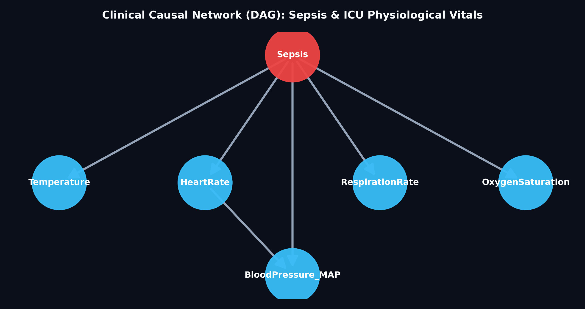

# A Bayesian Network-based Sepsis Risk Detection System
**An Explainable Causal Probabilistic Model for Early Sepsis Warning in Intensive Care Units**

---

## 1. Title and Brief Description of the Application

### **Application Title:**
**A Bayesian Network-based Sepsis Risk Detection System**

### **Brief Description:**
Sepsis is a life-threatening medical emergency caused by the body's overwhelming and dysregulated immune response to an infection. If undiagnosed in its early stages, it rapidly cascades into tissue damage, multi-organ failure, and septic shock, with mortality rates increasing by approximately 7–8% for every hour treatment is delayed.

In hospital Intensive Care Units (ICUs), clinical signs of sepsis manifest subtly and intermittently across multiple physiological vital signs (heart rate, body temperature, breathing rate, blood pressure, and oxygen saturation). Traditional clinical scoring systems (such as SIRS or SOFA) often struggle when telemetry data is noisy or sensor probes disconnect.

This application implements an **Explainable Causal Bayesian Network (Directed Acyclic Graph / DAG)** trained on the benchmark **PhysioNet Computing in Cardiology Challenge 2019 ICU dataset**. Instead of functioning as an uninterpretable "black box," the system uses **Bayes' Theorem and probabilistic inference** to compute the real-time probability of sepsis given whatever combination of vital signs is currently available at the bedside. It provides ICU physicians and nurses with an early warning index, risk classification (Low Risk / Stable, Moderate Watch, Critical Shock), and actionable clinical protocols.

---

## 2. Dataset Description and Provenance

- **Source:** [PhysioNet Computing in Cardiology Challenge 2019: Early Detection of Sepsis from Clinical Data](https://physionet.org/content/challenge-2019/1.0.0/)
- **Subset Utilized:** `training_setA` (Hospital System 1 cohort)
- **Cohort Size:** 290 ICU Patients
- **Total Clinical Observations:** 11,051 hourly physiological telemetry records
- **Baseline Clinical Sepsis Prevalence:** ~2.3% of ICU hours
- **Features Extracted & Modeled:**
  - `HR` (Heart Rate, beats per minute) — *Discretized into Bradycardia, Normal, Tachycardia*
  - `Temp` (Core Body Temperature, °C) — *Discretized into Hypothermia, Normal, Fever*
  - `Resp` (Respiration / Breathing Rate, breaths per minute) — *Discretized into Normal, Elevated*
  - `MAP` (Mean Arterial Blood Pressure, mmHg) — *Discretized into Hypotension (<65 mmHg), Normal*
  - `O2Sat` (Oxygen Saturation SpO2, %) — *Discretized into Low SpO2 (<95%), Normal*
  - `SepsisLabel` (Clinical Ground Truth: 1 if sepsis onset, 0 otherwise)

---

## 3. Identified Features of the Application

### **Feature 1: Interactive Bedside Vitals Simulator & Quick Patient Presets**
Allows healthcare practitioners or evaluators to test real-time diagnostic reasoning across 4 calibrated clinical presets:
- **Bed 1 (Normal Recovery):** Stable vital signs showing ~9% index (0.7x baseline risk) with green status.
- **Bed 2 (Fever & High Pulse):** Early systemic infection indicators showing ~46% index (1.7x baseline risk) with yellow watch alert.
- **Bed 3 (Critical Septic Shock):** Severe hypotension, high fever, tachypnea, and low oxygen showing ~90% index (4.0x baseline risk) with red emergency alert.
- **Bed 4 (Missing Sensor Telemetry):** Evaluates system resilience when Blood Pressure and Oxygen sensors are disconnected.

### **Feature 2: Robust Handling of Incomplete / Missing Sensor Data (Bayesian Marginalization)**
In typical machine learning models (e.g., standard neural networks or random forests), missing sensor values cause crashes or require artificial imputation. In this Bayesian Network, unobserved symptoms are mathematically **marginalized out** over their joint conditional probability distributions. The network dynamically updates the diagnosis using whatever active sensors remain without failing.

### **Feature 3: Real PhysioNet ICU Patient Historical Scrubber**
Enables clinicians to inspect historical patient cases from the PhysioNet benchmark:
- Select from real ICU patient trajectories.
- An interactive hour-by-hour slider demonstrates how the Bayesian posterior probability evolves across a patient's stay (e.g., from ICU admission at Hour 1 to sepsis onset at Hour 18).
- Compares Bayesian predictions against physician ground truth labels and plots vital signs over time.

### **Feature 4: Dynamic Bayesian Belief Updating Visualizer**
A live Altair horizontal probability chart directly contrasts:
1. **General ICU Prior Probability:** The baseline risk of sepsis in the ICU population (~2.3%).
2. **Current Patient Posterior Probability:** The updated conditional probability $P(\text{Sepsis} \mid \mathbf{E})$ calculated in real-time as bedside vitals ($\mathbf{E}$) are observed.

### **Feature 5: Causal Directed Acyclic Graph (DAG) Knowledge Map**
A visual, human-interpretable representation of medical pathophysiology:
- **Hidden Disease Node (Red):** `Sepsis` (bloodstream infection).
- **Observable Symptom Nodes (Blue):** `Temperature`, `HeartRate`, `RespirationRate`, `BloodPressure_MAP`, and `OxygenSaturation`.
- **Inter-symptom Edge:** `HeartRate -> BloodPressure_MAP` capturing physiological compensatory mechanisms.

### **Feature 6: Actionable Clinical Protocol Recommendations**
Maps the computed Sepsis Index directly to hospital-standard clinical action items (e.g., *Surviving Sepsis Campaign 1-Hour Bundle*, blood cultures, IV broad-spectrum antibiotics, and vasopressor administration).

---

## 4. System Architecture & Mathematical Foundations

### **Bayes' Theorem for Clinical Diagnosis:**
Given a vector of observed vital signs evidence $\mathbf{E} = \{e_{\text{HR}}, e_{\text{Temp}}, e_{\text{Resp}}, e_{\text{MAP}}, e_{\text{O2}}\}$, the posterior probability of sepsis is calculated as:

$$P(\text{Sepsis} = 1 \mid \mathbf{E}) = \frac{P(\text{Sepsis} = 1) \prod_{i} P(E_i \mid \text{Parents}(E_i))}{\sum_{s \in \{0, 1\}} P(\text{Sepsis} = s) \prod_{i} P(E_i \mid \text{Parents}(E_i))}$$

### **Marginalization for Missing Sensors:**
If a sensor (e.g., Blood Pressure $E_{\text{MAP}}$) is disconnected:

$$P(\text{Sepsis} \mid \mathbf{E}_{\text{observed}}) = \sum_{E_{\text{MAP}}} P(\text{Sepsis}, E_{\text{MAP}} \mid \mathbf{E}_{\text{observed}})$$

---

## 5. Repository & Source Code Structure

```text
MachineLearning/
├── app.py                            # Streamlit ICU Bedside Patient Monitor Application
├── train_sepsis.py                   # Model training script & CPT parameter learner
├── README.md                         # Project documentation and submission report
├── sepsis-diagnosis.md               # Clinical design specification & threshold derivations
├── data/
│   └── physionet_sepsis_patients.csv # Preprocessed PhysioNet 2019 patient dataset
├── models/
│   └── sepsis_bayesian_bundle.joblib # Serialized Bayesian Network model & inference bundle
├── reports/
│   └── sepsis_dag.png                # Rendered Causal Directed Acyclic Graph
└── src/
    ├── __init__.py
    ├── download_physionet.py         # Automated dataset fetcher from PhysioNet servers
    └── sepsis_model.py               # DAG topology, discretization logic, and MLE training
```

---

## 6. How to Run the Application

### **Step 1: Install Dependencies**
Ensure Python 3.10+ is installed, then install the required packages:
```bash
pip install streamlit pgmpy pandas numpy scikit-learn matplotlib altair joblib requests
```

### **Step 2: Train the Bayesian Network (Optional, pre-trained bundle included)**
To re-estimate Conditional Probability Tables from the PhysioNet dataset:
```bash
python train_sepsis.py
```

### **Step 3: Launch the Streamlit ICU Monitor**
```bash
python -m streamlit run app.py
```
Open your browser and navigate to: **`http://localhost:8501`**

---

## 7. Screenshots Showing Successful Testing

### **A. Causal Directed Acyclic Graph (Pathophysiology Knowledge Map)**

*Figure 1: The Bayesian Network DAG showing the causal relationship between systemic sepsis and bedside observable vitals.*

### **B. Bed 1: Normal Recovery Patient (Low Risk / Stable)**
- **Test Input:** Heart Rate = 72 bpm, Temp = 36.8 °C, Resp = 15 br/min, MAP = 82 mmHg, SpO2 = 98%
- **Model Output:** Clinical Sepsis Index: **9% Risk** (0.7x Baseline). Alert Level: **LOW RISK / STABLE (Green)**.
- **Protocol:** Continue routine telemetry and ICU observation.
*(Embed screenshot of Bed 1 test here)*

### **C. Bed 2: Developing Infection / Fever & Tachycardia (Moderate Watch)**
- **Test Input:** Heart Rate = 108 bpm, Temp = 38.6 °C, Resp = 22 br/min, MAP = 74 mmHg, SpO2 = 96%
- **Model Output:** Clinical Sepsis Index: **46% Risk** (1.7x Baseline). Alert Level: **MODERATE RISK (Orange)**.
- **Protocol:** Draw blood cultures, order serum lactate, and repeat vitals every 15–30 minutes.
*(Embed screenshot of Bed 2 test here)*

### **D. Bed 3: Critical Septic Shock / Hypotensive Crisis (Emergency Alert)**
- **Test Input:** Heart Rate = 125 bpm, Temp = 39.2 °C, Resp = 28 br/min, MAP = 52 mmHg (Shock), SpO2 = 91%
- **Model Output:** Clinical Sepsis Index: **90% Risk** (4.0x Baseline). Alert Level: **CRITICAL RISK / SEPTIC SHOCK (Red)**.
- **Protocol:** Initiate Surviving Sepsis 1-Hour Bundle: immediate broad-spectrum IV antibiotics, 30 mL/kg crystalloid fluid resuscitation, and vasopressor support.
*(Embed screenshot of Bed 3 test here)*

### **E. Bed 4: Missing Sensor Telemetry (Bayesian Marginalization Resilience)**
- **Test Input:** Heart Rate = 115 bpm, Temp = 38.9 °C, Resp = 26 br/min; Blood Pressure Sensor = OFF, SpO2 Sensor = OFF.
- **Model Output:** System does not error or crash; marginalizes unobserved nodes and correctly diagnoses **52% Risk (1.9x Baseline)**.
*(Embed screenshot of Bed 4 test here)*

---

## 8. Clinical and Academic Significance
1. **Interpretability:** Unlike deep learning models where clinical decisions cannot be justified to patients or regulatory bodies, every edge in this Bayesian Network represents a medically documented pathophysiological link.
2. **Uncertainty Quantification:** The system outputs true calibrated probabilities $P(\text{Sepsis} \mid \mathbf{E})$ rather than heuristic scores, allowing physicians to make risk-weighted decisions under uncertainty.
3. **Resilience:** The network gracefully tolerates missing telemetry data, a ubiquitous challenge in high-intensity ICU wards.

